# ESP32-S2 Micromouse Hardware

Hardware development for an autonomous Micromouse robot designed for the RoboUAQ 2026 maze competition.

The project focused on translating strict competition requirements into a compact electronic system integrating processing, sensing, motor interfaces and power electronics on a custom double-sided PCB.

## Design Constraints

The competition imposed several requirements that directly influenced the hardware design:

- Maximum robot dimensions: **10 × 10 × 5 cm**
- Fully autonomous operation
- No external communication during competition runs
- Battery-powered operation
- Single-button startup
- No complete commercial robot kits

These constraints required the electronics, sensors, power stages, motor connections and controller to be integrated within a very limited mechanical envelope.

## My Contribution

This project was developed by a three-member team.

My primary responsibility was the **electronic hardware development**, including:

- Translating competition requirements into hardware constraints.
- Researching and selecting electronic components.
- Designing the complete electronic schematic in EasyEDA.
- Planning the power-distribution and motor-control architecture.
- Integrating the ESP32-S2 Mini, motor interfaces, sensing channels and power stages.
- Designing and routing a compact double-sided PCB.
- Adapting the PCB geometry to the dimensional limits of the robot.
- Fabricating the two-layer PCB using an in-house PCB manufacturing process.
- Soldering and assembling electronic components.
- Performing hardware integration and troubleshooting during prototype assembly.
- Coordinating hardware interfaces with the mechanical and firmware requirements of the team.

## Hardware Architecture

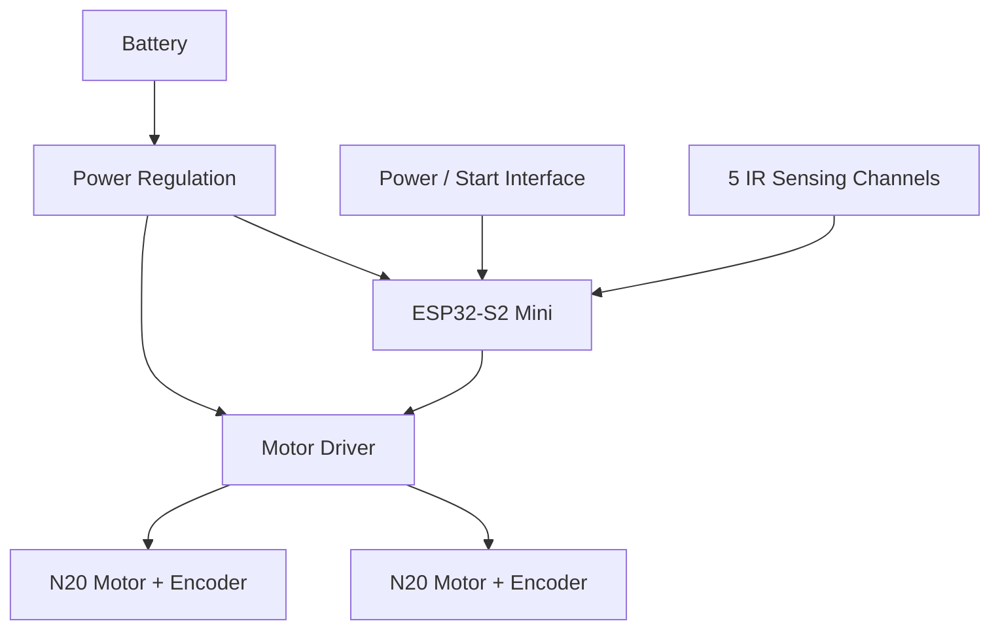

The PCB was designed as the central integration platform for the robot, combining the microcontroller, motor connections, sensor interfaces and power electronics in a compact form factor.

## Main Hardware

- **ESP32-S2 Mini** microcontroller board
- Dual DC motor driver stage
- **N20 DC gearmotors with encoders**
- Five infrared sensing channels
- Battery input through XT30 connector
- DC-DC power conversion and voltage regulation
- Bulk and local decoupling capacitors
- Dedicated motor and sensor connectors
- Main power switch
- Custom two-layer PCB

## Development Workflow

The hardware was developed through the following process:

```text
Competition requirements
          ↓
Hardware requirements
          ↓
Component research and selection
          ↓
Schematic design
          ↓
PCB layout and routing
          ↓
Double-sided PCB fabrication
          ↓
Soldering and assembly
          ↓
Electrical bring-up
          ↓
Mechanical integration
          ↓
Prototype testing and troubleshooting
```

## Schematic Design

The complete electronic schematic was designed in **EasyEDA Pro**.

<p align="center">
  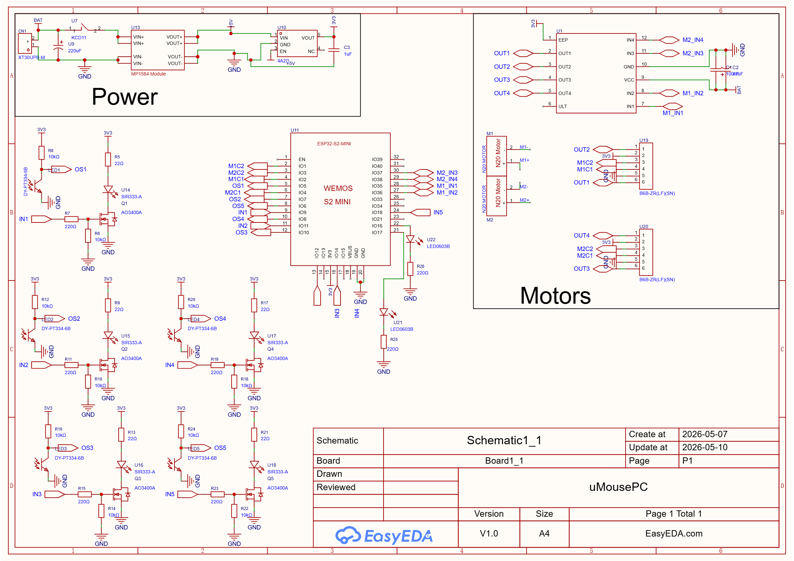
</p>

The original editable EasyEDA project is preserved in:

```text
hardware/design/easyeda/umouse_hardware.epro2
```

A PDF version of the schematic is also available in:

```text
hardware/schematic/umouse_schematic.pdf
```

## PCB Design

The PCB was designed as a **double-sided board** to integrate the electronics within the dimensional restrictions of the Micromouse platform.

### Top Layer

<p align="center">
  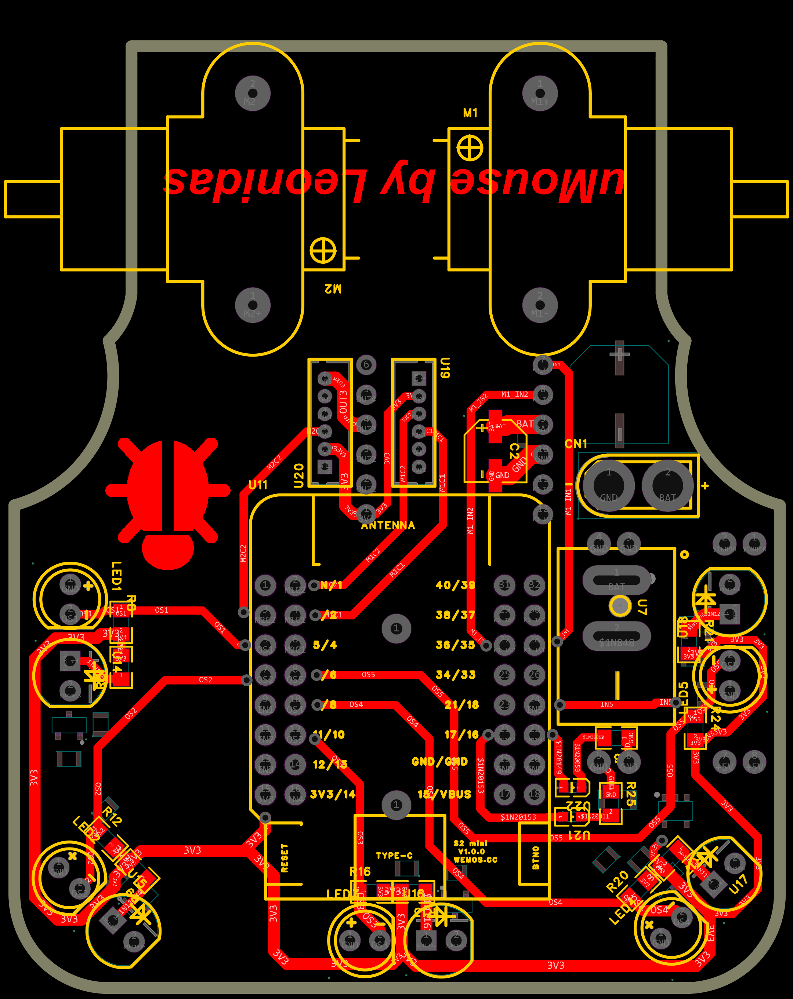
</p>

### Bottom Layer

<p align="center">
  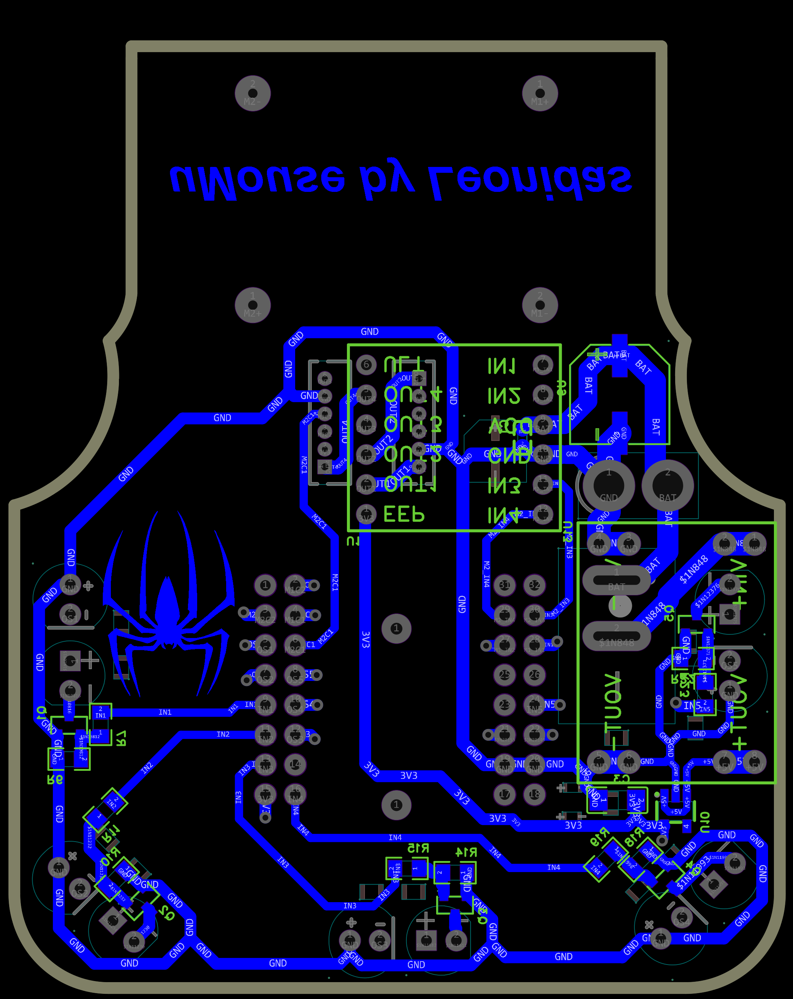
</p>

The repository also contains the fabrication Gerbers and PCB layout PDF.

## PCB Fabrication

The board was physically fabricated using a manual double-sided PCB process.

<p align="center">
  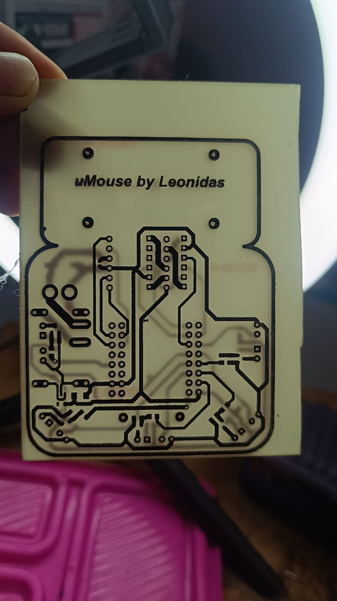
  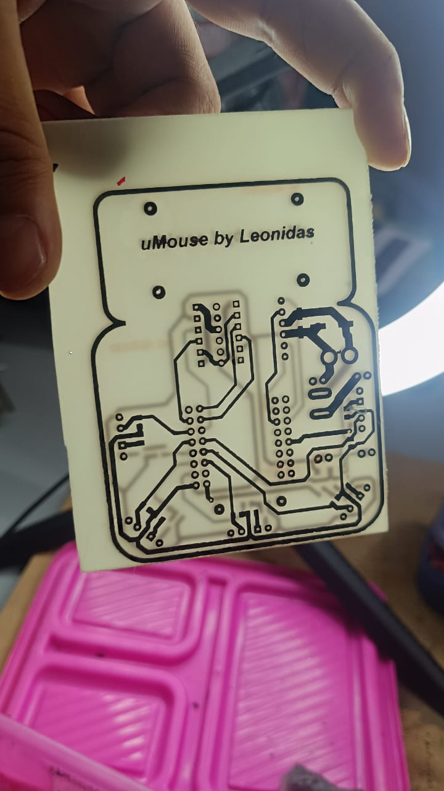
</p>

These images show both copper layers before component assembly.

## Assembly

After fabrication, the electronic components, connectors, sensing elements and controller were assembled onto the board.

<p align="center">
  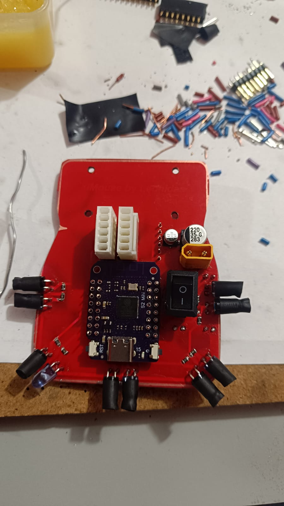
  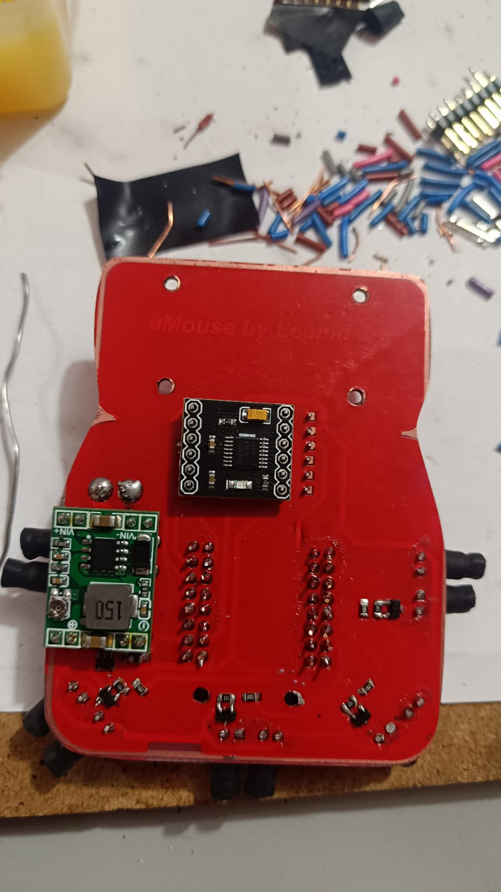
</p>

The assembled prototype includes the ESP32-S2 Mini, power interface, sensor circuitry and connections required for the motors and remaining subsystems.

## Robot Integration

The custom PCB was then integrated with the mechanical structure, motors, encoders and battery system.

<p align="center">
  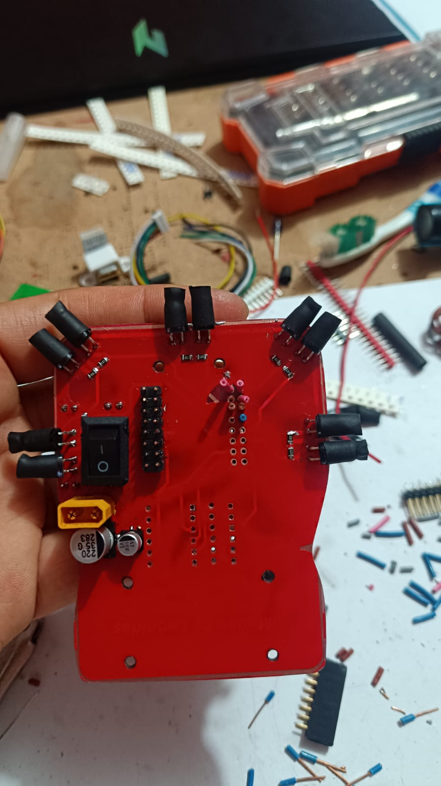
  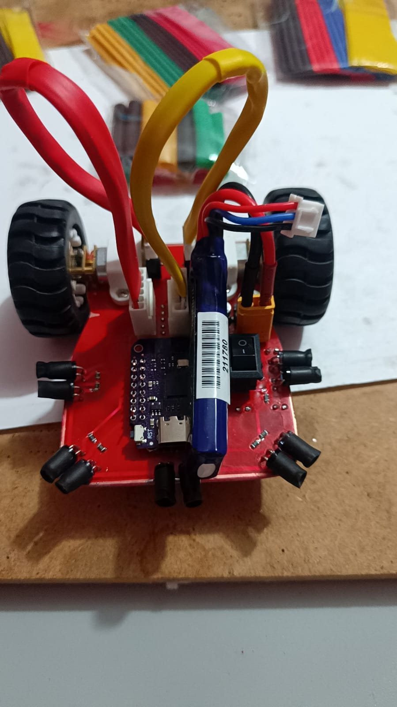
</p>

### Final Hardware Integration

<p align="center">
  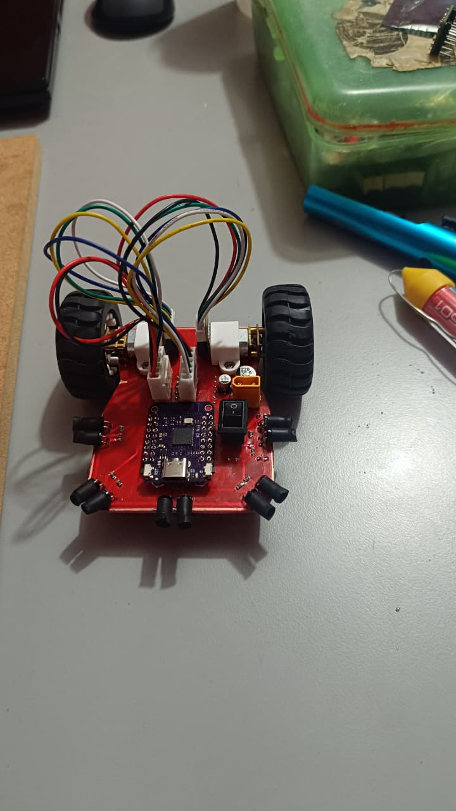
</p>

## Repository Structure

```text
esp32-s2-micromouse-hardware/
│
├── hardware/
│   ├── design/
│   │   └── easyeda/
│   │       └── umouse_hardware.epro2
│   │
│   ├── schematic/
│   │   ├── umouse_schematic.pdf
│   │   └── umouse_schematic.png
│   │
│   └── pcb/
│       ├── pcb_top.png
│       ├── pcb_bottom.png
│       ├── pcb_layout.pdf
│       └── gerbers/
│           └── umouse_gerbers.zip
│
├── docs/
│   ├── competition/
│   │   └── robouaq_2026_micromouse_rules.pdf
│   │
│   └── images/
│       ├── pcb_fabrication_side_a.jpg
│       ├── pcb_fabrication_side_b.jpg
│       ├── pcb_assembled_top.jpg
│       ├── pcb_assembled_bottom.jpg
│       ├── micromouse_prototype.jpg
│       ├── micromouse_integrated.jpg
│       └── micromouse_final_hardware.jpg
│
├── .gitignore
└── README.md
```

## Design and Development Tools

- EasyEDA Pro
- ESP32-S2
- PCB schematic capture
- Two-layer PCB layout
- Manual PCB fabrication
- SMD/THT soldering
- Multimeter
- Oscilloscope
- Laboratory power supply
- ESP-IDF for hardware bring-up and testing
- Git / GitHub

## Project Scope

This repository focuses primarily on the **electronic hardware contribution** to the Micromouse project.

Navigation algorithms and the complete competition firmware were collaborative or separate team responsibilities and are therefore not presented here as individual work.

Hardware bring-up and diagnostic firmware may be added separately when the corresponding source files are organized and documented.

## Competition

The hardware was developed for the **RoboUAQ 2026 Robot Laberinto Minimouse** competition organized through the Universidad Autónoma de Querétaro Faculty of Engineering.

The original competition rules are preserved under:

```text
docs/competition/robouaq_2026_micromouse_rules.pdf
```

## Project Status

Hardware design and physical prototype completed.

The repository is being organized as a technical archive and engineering portfolio project. Future updates may include:

- Bill of Materials (BOM)
- Detailed power architecture documentation
- IR sensing circuit documentation
- Hardware bring-up firmware
- ADC and sensor characterization results
- Encoder interface documentation
- Design retrospective and identified improvements